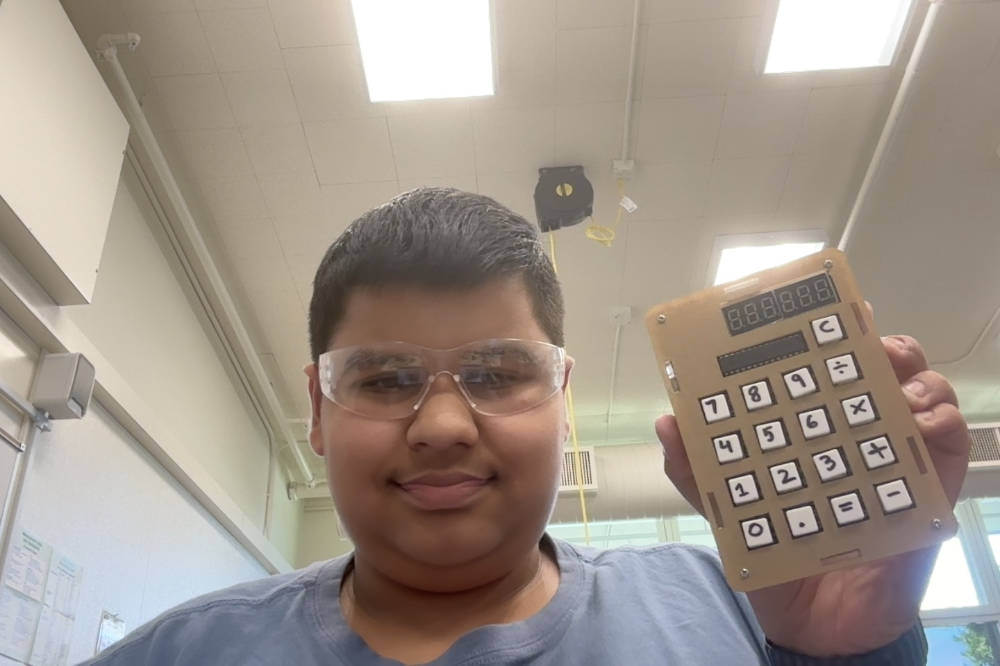

# Tilt Controlled Marble Maze
The deceptively simple yet perfect game! Combining the love of mazes with an exiting touch of robotics, this project uses the accelerometer on the Circuit Playground Express board to control the X and Y directions of motion of a maze. You can guide a marble through the maze by simply tilting the CPX. What's neat is that this project is constructed using only cardboard, hot glue, and a couple of screws.

) 

| **Engineer** | **School** | **Area of Interest** | **Grade** |
|:--:|:--:|:--:|:--:|
| Manan G | The Harker School | Mechanical Engineering | Incoming Sophomore

**Replace the BlueStamp logo below with an image of yourself and your completed project. Follow the guide [here](https://tomcam.github.io/least-github-pages/adding-images-github-pages-site.html) if you need help.**


  
# Final Milestone

**Don't forget to replace the text below with the embedding for your milestone video. Go to Youtube, click Share -> Embed, and copy and paste the code to replace what's below.**

<iframe width="560" height="315" src="https://www.youtube.com/embed/F7M7imOVGug" title="YouTube video player" frameborder="0" allow="accelerometer; autoplay; clipboard-write; encrypted-media; gyroscope; picture-in-picture; web-share" allowfullscreen></iframe>

For your final milestone, explain the outcome of your project. Key details to include are:
- What you've accomplished since your previous milestone
- What your biggest challenges and triumphs were at BSE
- A summary of key topics you learned about
- What you hope to learn in the future after everything you've learned at BSE


# Second Milestone

**Don't forget to replace the text below with the embedding for your milestone video. Go to Youtube, click Share -> Embed, and copy and paste the code to replace what's below.**

<iframe width="560" height="315" src="https://www.youtube.com/embed/y3VAmNlER5Y" title="YouTube video player" frameborder="0" allow="accelerometer; autoplay; clipboard-write; encrypted-media; gyroscope; picture-in-picture; web-share" allowfullscreen></iframe>

For your second milestone, explain what you've worked on since your previous milestone. You can highlight:
- Technical details of what you've accomplished and how they contribute to the final goal
- What has been surprising about the project so far
- Previous challenges you faced that you overcame
- What needs to be completed before your final milestone 

# First Milestone

**Don't forget to replace the text below with the embedding for your milestone video. Go to Youtube, click Share -> Embed, and copy and paste the code to replace what's below.**

<iframe width="560" height="315" src="https://www.youtube.com/embed/CaCazFBhYKs" title="YouTube video player" frameborder="0" allow="accelerometer; autoplay; clipboard-write; encrypted-media; gyroscope; picture-in-picture; web-share" allowfullscreen></iframe>

For your first milestone, describe what your project is and how you plan to build it. You can include:
- An explanation about the different components of your project and how they will all integrate together
- Technical progress you've made so far
- Challenges you're facing and solving in your future milestones
- What your plan is to complete your project

# Schematics 
Here's where you'll put images of your schematics. [Tinkercad](https://www.tinkercad.com/blog/official-guide-to-tinkercad-circuits) and [Fritzing](https://fritzing.org/learning/) are both great resoruces to create professional schematic diagrams, though BSE recommends Tinkercad becuase it can be done easily and for free in the browser. 

# Code
Here's where you'll put your code. The syntax below places it into a block of code. Follow the guide [here]([url](https://www.markdownguide.org/extended-syntax/)) to learn how to customize it to your project needs. 

```python
# SPDX-FileCopyrightText: 2019 Anne Barela for Adafruit Industries
# SPDX-License-Identifier: MIT
# CircuitPython code for the Gyroscopic Marble Maze
# Adafruit Industries, 2019. MIT License
import time
import board
import pwmio
from adafruit_motor import servo
import simpleio
from adafruit_circuitplayground.express import cpx


# create a PWMOut object on Pin A2.
pwm1 = pwmio.PWMOut(board.A1, duty_cycle=2 ** 15, frequency=50)
pwm2 = pwmio.PWMOut(board.A2, duty_cycle=2 ** 15, frequency=50)

# Create a servo object, my_servo.
my_servo1 = servo.Servo(pwm1)
my_servo2 = servo.Servo(pwm2)
NUM_READINGS = 8
roll_readings = [90] * NUM_READINGS
pitch_readings = [90] * NUM_READINGS

def Average(lst):
    return (sum(lst) / len(lst))

while True:
    x, y, z = cpx.acceleration # x = green
    print((x, y, z))
    roll = simpleio.map_range(x, -9.8, 9.8, 0, 180)
    roll_readings = roll_readings[1:]
    roll_readings.append(roll)
    roll = Average(roll_readings)
    print(roll)
    my_servo1.angle = roll
    pitch = simpleio.map_range(y, -9.8, 9.8, 0, 180)
    pitch_readings = pitch_readings[1:]
    pitch_readings.append(pitch)
    pitch = Average(pitch_readings)
    print(pitch)
    my_servo2.angle = pitch
    time.sleep(0.05)

```

# Bill of Materials
Here's where you'll list the parts in your project. To add more rows, just copy and paste the example rows below.
Don't forget to place the link of where to buy each component inside the quotation marks in the corresponding row after href =. Follow the guide [here]([url](https://www.markdownguide.org/extended-syntax/)) to learn how to customize this to your project needs. 

| **Part** | **Notes** | **Price** | **Link** |
|:--:|:--:|:--:|:--:|
| Circuit Playground Express Board | Controller, what you tilt | $24.95 | <a href="[https://www.amazon.com/Arduino-A000066-ARDUINO-UNO-R3/dp/B008GRTSV6/](https://www.adafruit.com/product/169)"> Link </a> |
| Utech Smart USB-C Hub | USB-C to USB-A adapter | $29.99 | <a href="[https://www.amazon.com/Arduino-A000066-ARDUINO-UNO-R3/dp/B008GRTSV6](https://www.amazon.com/UtechSmart-Ethernet-Delivery-Compatible-Chromebook/dp/B07H2ZS1B5)"> Link </a> |
| USB-A to Micro-B cable | USB-A to Micro-B adapter | $2.95 | <a href="[https://www.amazon.com/Arduino-A000066-ARDUINO-UNO-R3/dp/B008GRTSV6/](https://www.adafruit.com/product/592)"> Link </a> |
| Small Alligator Clip to Male Jumper Wire Bundle - 6 Pieces | Connecting CPX to Servos  | $3.95 | <a href="[[https://www.amazon.com/Arduino-A000066-ARDUINO-UNO-R3/dp/B008GRTSV6/](https://www.adafruit.com/product/592)](https://www.adafruit.com/product/3448)"> Link </a> |
| Micro servo - TowerPro SG92R - 2 pieces | Servos controlling maze tilt  | $11.90 | <a href="[[[https://www.amazon.com/Arduino-A000066-ARDUINO-UNO-R3/dp/B008GRTSV6/](https://www.adafruit.com/product/592)](https://www.adafruit.com/product/3448)](https://www.adafruit.com/product/169)"> Link </a> |

# Other Resources/Examples
One of the best parts about Github is that you can view how other people set up their own work. Here are some past BSE portfolios that are awesome examples. You can view how they set up their portfolio, and you can view their index.md files to understand how they implemented different portfolio components.
- [Example 1](https://trashytuber.github.io/YimingJiaBlueStamp/)
- [Example 2](https://sviatil0.github.io/Sviatoslav_BSE/)
- [Example 3](https://arneshkumar.github.io/arneshbluestamp/)

