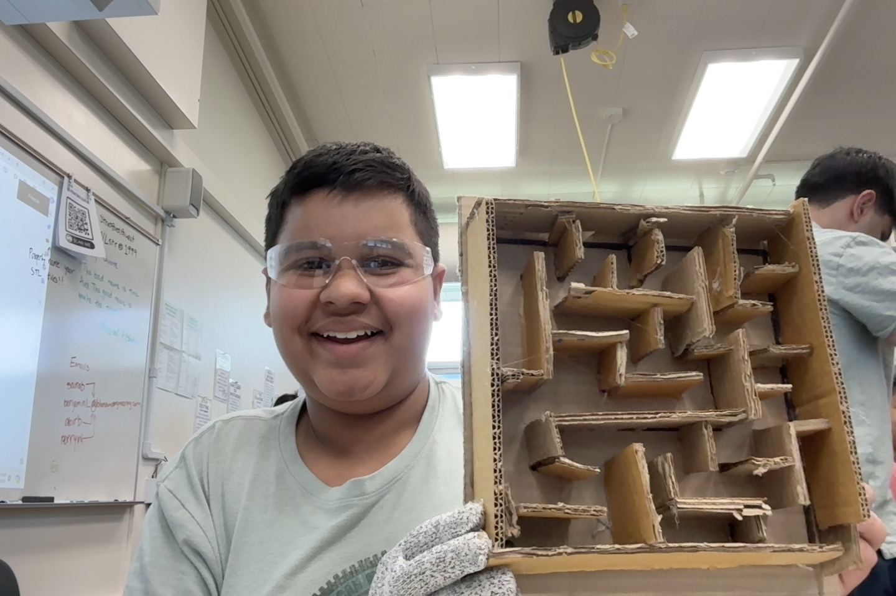

# Tilt Controlled Marble Maze
This deceptively simple yet perfect game combines my love for robotics with a classic game, mazes. Using an accelerometer on the Circuit Playground Express board to control the X and Y directions of motion of a maze, the user can guide a marble through the maze by simply tilting the CPX. What's neat is that this project is constructed using only cardboard, hot glue, and a couple of screws.




| **Engineer** | **School** | **Area of Interest** | **Grade** |
|:--:|:--:|:--:|:--:|
| Manan G | The Harker School | Mechanical Engineering | Incoming Sophomore


  
# Final Milestone


**Don't forget to replace the text below with the embedding for your milestone video. Go to Youtube, click Share -> Embed, and copy and paste the code to replace what's below.**

<iframe width="560" height="315" src="https://www.youtube.com/embed/F7M7imOVGug" title="YouTube video player" frameborder="0" allow="accelerometer; autoplay; clipboard-write; encrypted-media; gyroscope; picture-in-picture; web-share" allowfullscreen></iframe>

For your final milestone, explain the outcome of your project. Key details to include are:
- What you've accomplished since your previous milestone
- What your biggest challenges and triumphs were at BSE
- A summary of key topics you learned about
- What you hope to learn in the future after everything you've learned at BSE


# Second Milestone


**Don't forget to replace the text below with the embedding for your milestone video. Go to Youtube, click Share -> Embed, and copy and paste the code to replace what's below.**

<iframe width="1515" height="685" src="https://www.youtube.com/embed/n2mZ4HnMIKA" title="Manan G. Second Milestone" frameborder="0" allow="accelerometer; autoplay; clipboard-write; encrypted-media; gyroscope; picture-in-picture; web-share" referrerpolicy="strict-origin-when-cross-origin" allowfullscreen></iframe>

For your second milestone, explain what you've worked on since your previous milestone. You can highlight:
- Technical details of what you've accomplished and how they contribute to the final goal
- What has been surprising about the project so far
- Previous challenges you faced that you overcame
- What needs to be completed before your final milestone 


# First Milestone


<iframe width="560" height="315" src="https://www.youtube.com/embed/1GwePFE109M?si=EvfzNja3QYFJpNB3" title="YouTube video player" frameborder="0" allow="accelerometer; autoplay; clipboard-write; encrypted-media; gyroscope; picture-in-picture; web-share" referrerpolicy="strict-origin-when-cross-origin" allowfullscreen></iframe>

For your first milestone, describe what your project is and how you plan to build it. You can include:
- An explanation about the different components of your project and how they will all integrate together
- Technical progress you've made so far
- Challenges you're facing and solving in your future milestones
- What your plan is to complete your project

# Schematics 
Here's where you'll put images of your schematics. [Tinkercad](https://www.tinkercad.com/blog/official-guide-to-tinkercad-circuits) and [Fritzing](https://fritzing.org/learning/) are both great resoruces to create professional schematic diagrams, though BSE recommends Tinkercad becuase it can be done easily and for free in the browser. 

# Code
One of things that I'm sure I will take away from BlueStamp is how I learnt Object Oriented programming. To understand this code, I had Gemini AI teach me the basics of OOP. I then applied this in my code. This OOP code is the heart and soul of the project: it communicates with the CPX, which tells how and when the servo-motors should move. Different from standard user input-output programs, this code must take in input the "tilting" of the CPX; detect the direction of tilt; pick the correct motor (x- or y-direction motor); tell the servo to move in the appropriate angle.


```python
# Edited by Manan G
# SPDX-FileCopyrightText: 2019 Anne Barela for Adafruit Industries
# SPDX-License-Identifier: MIT
# CircuitPython code for the Gyroscopic Marble Maze
# Adafruit Industries, 2019. MIT License
import time
import board
import pwmio
from adafruit_motor import servo
import simpleio
from adafruit_circuitplayground.express import cpx


# create a PWMOut object on Pin A2.
pwm1 = pwmio.PWMOut(board.A1, duty_cycle=2 ** 15, frequency=50)
pwm2 = pwmio.PWMOut(board.A2, duty_cycle=2 ** 15, frequency=50)

# Create a servo object, my_servo.
my_servo1 = servo.Servo(pwm1)
my_servo2 = servo.Servo(pwm2)
NUM_READINGS = 8
roll_readings = [90] * NUM_READINGS
pitch_readings = [90] * NUM_READINGS

def Average(lst):
    return (sum(lst) / len(lst))

while True:
    x, y, z = cpx.acceleration # x = green
    print((x, y, z))
    roll = simpleio.map_range(x, -9.8, 9.8, 0, 180)
    roll_readings = roll_readings[1:]
    roll_readings.append(roll)
    roll = Average(roll_readings)
    print(roll)
    my_servo1.angle = roll
    pitch = simpleio.map_range(y, -9.8, 9.8, 0, 180)
    pitch_readings = pitch_readings[1:]
    pitch_readings.append(pitch)
    pitch = Average(pitch_readings)
    print(pitch)
    my_servo2.angle = pitch
    time.sleep(0.05)

```


# Bill of Materials
One of the more affordable projects, the Marble Maze requires very few technical components: these being the CircuitPython Express Board and the two Servos. Most of the other items are generic and can probably be found in an Office Depot/some Toolshop. This includes a Hot Glue Gun, Wires, etc. For cardboard, I used scrap cardboard from Amazon packages, and they worked perfectly!

| **Part** | **Notes** | **Price** | **Link** |
|:--:|:--:|:--:|:--:|
| Circuit Playground Express Board | Controller, what you tilt | $24.95 | <a href="https://www.adafruit.com/product/169"> Purchase here! </a> |
| Utech Smart USB-C Hub | USB-C to USB-A adapter | $29.99 | <a href="https://www.amazon.com/UtechSmart-Ethernet-Delivery-Compatible-Chromebook/dp/B07H2ZS1B5"> Any works, recommended here </a> |
| USB-A to Micro-B cable | USB-A to Micro-B adapter | $2.95 | <a href="https://www.adafruit.com/product/592"> Purchase here! </a> |
| Small Alligator Clip to Male Jumper Wire Bundle - 6 Pieces | Connecting CPX to Servos  | $3.95 | <a href="https://www.adafruit.com/product/3448"> Recommended here </a> |
| Micro servo - TowerPro SG92R - 2 pieces | Servos controlling maze tilt  | $11.90 | <a href="https://www.adafruit.com/product/169"> Purchase here! </a> |
| Hot Glue Gun | Any gun works; used to glue maze walls/parts together  | $9.99 | <a href="https://www.amazon.com/Krightlink-Sticks-School-Crafts-Repairs/dp/B0BC878ZRG/ref=sr_1_4_sspa?dib=eyJ2IjoiMSJ9.4XQ5ZC91OMSN2e0ykixncWkpGm2CphQhln5n11prYd3XvQzbUDwoeTvtkyMVCOB18pH_NSvfWIwJsSiW6ognqtuvHSmSt8SIliIwakCwBLdrDD5ZO1TNb5saKvh0jEodvAU8oYZOqVif4n93Mjvvsg-vCcaWSyRJCVgWJBhtljkUw-zP0sQpEah__iEzjbRKLfJWeXAmsvA06BxTp8Xz9u__s4t387PldiJe2VCkdZW2PE7qRLsmQGdlslFLAyYSfZlQJie8Bb89jmPUHJf31gOAlpSIMXDjKV4VV3pWofw.AifZQErxvz0Yv-iaGeEqoAo7N6UJM3dCIrKcbmG2h1w&dib_tag=se&hvadid=598724400377&hvdev=c&hvlocphy=9032183&hvnetw=g&hvqmt=b&hvrand=6841085219243952434&hvtargid=kwd-322848738459&hydadcr=4866_13229483&keywords=hot-glue%2Bgun&qid=1720042211&sr=8-4-spons&sp_csd=d2lkZ2V0TmFtZT1zcF9hdGY&th=1"> Any works, recommended here </a> |
| Carboard | Build the maze and frame  | $0+ | Scrap works! |

# Starter Project

<iframe width="560" height="315" src="https://www.youtube.com/embed/Ic72ahxqY6g?si=ug5FnIE2N02ikeoR" title="YouTube video player" frameborder="0" allow="accelerometer; autoplay; clipboard-write; encrypted-media; gyroscope; picture-in-picture; web-share" referrerpolicy="strict-origin-when-cross-origin" allowfullscreen></iframe>

