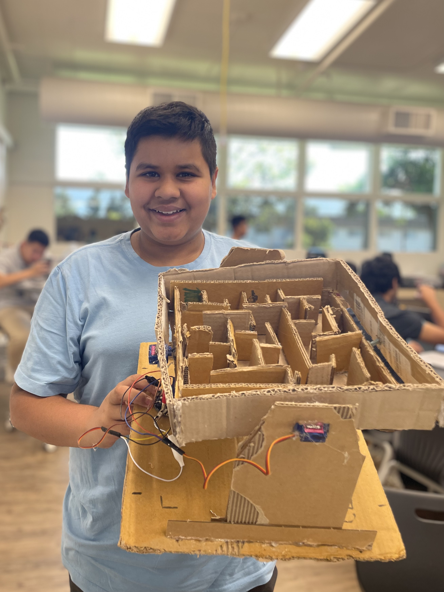

# Robotics meets Retro: Gyroscopic Marble Maze!
This deceptively simple yet perfect game combines my love for robotics with a classic game, mazes. Using an accelerometer on the Circuit Playground Express board to control the X and Y directions of motion of a maze, the user can guide a marble through the maze by simply tilting the CPX. What's neat is that this project is constructed using only cardboard, hot glue, and a couple of screws.



| **Engineer** | **School** | **Area of Interest** | **Grade** |
|:--:|:--:|:--:|:--:|
| Manan G | The Harker School | Mechanical Engineering | Incoming Sophomore |

# Final Product + Modifications

**Don't forget to replace the text below with the embedding for your milestone video. Go to Youtube, click Share -> Embed, and copy and paste the code to replace what's below.**

<iframe width="600" height="337.5" src="https://www.youtube.com/embed/J0dHu-L973g?si=cwvlc1rMnfl08ZGQ" title="YouTube video player" frameborder="0" allow="accelerometer; autoplay; clipboard-write; encrypted-media; gyroscope; picture-in-picture; web-share" referrerpolicy="strict-origin-when-cross-origin" allowfullscreen></iframe>

For your final milestone, explain the outcome of your project. Key details to include are:
- What you've accomplished since your previous milestone
- What your biggest challenges and triumphs were at BSE
- A summary of key topics you learned about
- What you hope to learn in the future after everything you've learned at BSE


# Final Milestone

**Don't forget to replace the text below with the embedding for your milestone video. Go to Youtube, click Share -> Embed, and copy and paste the code to replace what's below.**

<iframe width="600" height="337.5" src="https://www.youtube.com/embed/H_UHTcFpMa8?si=cbOVfYRwUvffjqpX" title="YouTube video player" frameborder="4" allow="accelerometer; autoplay; clipboard-write; encrypted-media; gyroscope; picture-in-picture; web-share" referrerpolicy="strict-origin-when-cross-origin" allowfullscreen></iframe>

For your final milestone, explain the outcome of your project. Key details to include are:
- What you've accomplished since your previous milestone
- What your biggest challenges and triumphs were at BSE
- A summary of key topics you learned about
- What you hope to learn in the future after everything you've learned at BSE


# Second Milestone

<iframe width="600" height="337.5" src="https://www.youtube.com/embed/n2mZ4HnMIKA" title="Manan G. Second Milestone" frameborder="0" allow="accelerometer; autoplay; clipboard-write; encrypted-media; gyroscope; picture-in-picture; web-share" referrerpolicy="strict-origin-when-cross-origin" allowfullscreen></iframe>

For your second milestone, explain what you've worked on since your previous milestone. You can highlight:
- Technical details of what you've accomplished and how they contribute to the final goal
- What has been surprising about the project so far
- Previous challenges you faced that you overcame
- What needs to be completed before your final milestone 


# First Milestone

<iframe width="600" height="337.5" src="https://www.youtube.com/embed/1GwePFE109M?si=EvfzNja3QYFJpNB3" title="YouTube video player" frameborder="0" allow="accelerometer; autoplay; clipboard-write; encrypted-media; gyroscope; picture-in-picture; web-share" referrerpolicy="strict-origin-when-cross-origin" allowfullscreen></iframe>


For my first milestone, I faced several challenges while setting up the circuitry. First, I had to install all necessary software. Installing CircuitPython and setting up the board was tough due to unhelpful guides online. Finding and importing the `adafruit_motor` folder and `simpleio.mpy` file libraries into the /lib folder was particularly difficult, as I had to scour confusing github pages to download them from. When I connected my laptop to the CPX, it showed up as disk `CPLAYBOOT` instead of `CIRCUITPY`, so I had to search online again to fix and reboot it using a .uf2 file, which was to be dragged onto the file to reset it. The code, although mostly provided to me, immediately struck me as inefficient and repetitive. In fact, I asked Gemini AI to teach me the basics of Object Oriented Programming; OOP helped me work with objects, like the `Servo` object my code intitialized using the `pwmio` and `board` imported modules. This code detects the angle of tilt on the CPX, sends a signal to the appropriate servo (either the x- or y-servo) and replicates that angle. That was it for the code initially, although I'm definetely planning to edit and polish it up soon. Although the wiring was simple, clipping the alligator wires to the board was tricky due to there not being any holder, but instead small holes. In the end I just wedged each of them in there (Fig. 1). Despite these obstacles, I managed to get the servo motors connected and moving. The schematic was fairly easy to follow, and since I had worked with servos before I understood there are three connection that are to be made for a servo to work: the red wire, a power connection; the brown wire, a ground connection; and the yellow wire, the signal transmitter. Looking ahead, I plan to construct all the cardboard components, including the base, walls, all inner walls, the x-frame, and the base with y-pillars.


*Figure 1: Schematic depicting configuration of wires hooked up to x- and y-servos*

# Code
One of things that I'm sure I will take away from BlueStamp is how I learnt Object Oriented programming. To understand this code, I had Gemini AI teach me the basics of OOP. I then applied this in my code. This OOP code is the heart and soul of the project: it communicates with the CPX, which tells how and when the servo-motors should move. Different from standard user input-output programs, this code must take in input the "tilting" of the CPX; detect the direction of tilt; pick the correct motor (x- or y-direction motor); tell the servo to move in the appropriate angle.


```python
# Created by Manan G, BSE
# Inspired by Adafruit Industries, 2019. MIT License
# BSE, Jul 2024

import board
import pwmio
import simpleio
import time
from adafruit_circuitplayground import cp
from adafruit_circuitplayground.express import cpx
from adafruit_motor import servo

"######################### HELPER #########################"

def map_range_w_sensitivity(value, min_in, max_in, min_out, max_out, sensitivity):
    return simpleio.map_range(value * sensitivity, min_in, max_in, min_out, max_out)

def avg(lst):
    return (sum(lst)) / (len(lst))
    
def updt_servo_angle(value, servo, readings):
    # Apply sensitivity based on difficulty
    adjusted_value = map_range_w_sensitivity(
        value, -9.8, 9.8, 0, 180, current_difficulty
    )
    # Update readings list and calc average
    readings = readings[1:]
    readings.append(adjusted_value)
    adjusted_value = avg(readings)
    print(adjusted_value)
    servo.angle = adjusted_value
    return readings

def updt_led_from_tilt(x, y):
    # MOD! LED color control based on |tilt| (red for roll, green for pitch)
    scaled_red = abs(x) * 6
    scaled_green = abs(y) * 6
    cp.pixels[3:10] = [(scaled_red, scaled_green, 1)] * 7  # Light up half of display

def updt_difficulty():
    global current_difficulty, checker
    # Turn off all LEDs initially
    cp.pixels[1:4] = [(0, 0, 0)] * 3  # Set all pixels to black (off)
    cp.pixels.show()  # Update display to reflect changes
    if current_difficulty <= 1 and not checker:
        current_difficulty = 1
        checker = True
        cp.pixels[0] = (0, 0, 20)
    else:
        current_difficulty += 0.5

        if current_difficulty == DIFFICULTY_LOW or current_difficulty == 0.5:
            current_difficulty = DIFFICULTY_LOW
            cp.pixels[0] = (0, 0, 20)  # Blue for low difficulty
            cp.play_tone(275, 0.5)
        elif current_difficulty == DIFFICULTY_MEDIUM:
            cp.pixels[0] = (0, 0, 20)  # Blue
            cp.pixels[1] = (0, 20, 0)  # Green for medium difficulty
            cp.play_tone(295, 0.5)
        elif current_difficulty == DIFFICULTY_HIGH:
            cp.pixels[0] = (0, 0, 20)  # Blue
            cp.pixels[1] = (0, 20, 0)  # Green
            cp.pixels[2] = (20, 0, 0)  # Red for high difficulty
            cp.play_tone(315, 0.5)
        else:
            current_difficulty = 1  # Reset counter after three presses
            checker = False
            cp.play_tone(255, 0.5)


    cp.pixels.show()
    time.sleep(0.02)

# Servo and LED Setup
# Create PWM objects in pin A1 and A2
pwm1 = pwmio.PWMOut(board.A1, duty_cycle=2 ** 15, frequency=50)
pwm2 = pwmio.PWMOut(board.A2, duty_cycle=2 ** 15, frequency=50)

# Create object 'servo'
my_servo1 = servo.Servo(pwm2)
my_servo2 = servo.Servo(pwm1)

"######################### MAIN PROGRAM #########################"

# MOD! Define difficulty levels with different sensitivity multipliers
DIFFICULTY_LOW = 1.0
DIFFICULTY_MEDIUM = 1.5
DIFFICULTY_HIGH = 2.0
current_difficulty = DIFFICULTY_LOW
checker = False

# Initialize mechanism to read tilt angles
NUM_READINGS = 10
roll_readings = [120] * NUM_READINGS
pitch_readings = [120] * NUM_READINGS

"""
Until it is unplugged, the CPX must read in acceleration, update the positions 
of the two servos, updated the tilt readings of each servo, and convert the tilt 
to an RGB display color code composed of more red hue for an x- and more green hue 
for a y-direction tilt.

"""
while avg(roll_readings) != 0:
    x, y, z = cpx.acceleration
    if cp.button_a: 
        updt_difficulty()
    roll_readings = updt_servo_angle(x, my_servo1, roll_readings)
    pitch_readings = updt_servo_angle(y, my_servo2, pitch_readings)
    updt_led_from_tilt(x, y)  # Mod!
    time.sleep(0.02)
```


# Bill of Materials
One of the more affordable projects, the Marble Maze requires very few technical components: these being the CircuitPython Express Board and the two Servos. Most of the other items are generic and can probably be found in an Office Depot/some Toolshop. This includes a Hot Glue Gun, Wires, etc. For cardboard, I used scrap cardboard from Amazon packages, and they worked perfectly!

| **Part** | **Notes** | **Price** | **Link** |
|:--:|:--:|:--:|:--:|
| Circuit Playground Express Board | Controller, what you tilt | $24.95 | <a href="https://www.adafruit.com/product/169"> Purchase here! </a> |
| Utech Smart USB-C Hub | USB-C to USB-A adapter | $29.99 | <a href="https://www.amazon.com/UtechSmart-Ethernet-Delivery-Compatible-Chromebook/dp/B07H2ZS1B5"> Any works, recommended here </a> |
| USB-A to Micro-B cable | USB-A to Micro-B adapter | $2.95 | <a href="https://www.adafruit.com/product/592"> Purchase here! </a> |
| Small Alligator Clip to Male Jumper Wire Bundle - 6 Pieces | Connecting CPX to Servos  | $3.95 | <a href="https://www.adafruit.com/product/3448"> Recommended here </a> |
| Micro servo - TowerPro SG92R - 2 pieces | Servos controlling maze tilt  | $11.90 | <a href="https://www.adafruit.com/product/169"> Purchase here! </a> |
| Hot Glue Gun | Any gun works; used to glue maze walls/parts together  | $9.99 | <a href="https://www.amazon.com/Krightlink-Sticks-School-Crafts-Repairs/dp/B0BC878ZRG/ref=sr_1_4_sspa?dib=eyJ2IjoiMSJ9.4XQ5ZC91OMSN2e0ykixncWkpGm2CphQhln5n11prYd3XvQzbUDwoeTvtkyMVCOB18pH_NSvfWIwJsSiW6ognqtuvHSmSt8SIliIwakCwBLdrDD5ZO1TNb5saKvh0jEodvAU8oYZOqVif4n93Mjvvsg-vCcaWSyRJCVgWJBhtljkUw-zP0sQpEah__iEzjbRKLfJWeXAmsvA06BxTp8Xz9u__s4t387PldiJe2VCkdZW2PE7qRLsmQGdlslFLAyYSfZlQJie8Bb89jmPUHJf31gOAlpSIMXDjKV4VV3pWofw.AifZQErxvz0Yv-iaGeEqoAo7N6UJM3dCIrKcbmG2h1w&dib_tag=se&hvadid=598724400377&hvdev=c&hvlocphy=9032183&hvnetw=g&hvqmt=b&hvrand=6841085219243952434&hvtargid=kwd-322848738459&hydadcr=4866_13229483&keywords=hot-glue%2Bgun&qid=1720042211&sr=8-4-spons&sp_csd=d2lkZ2V0TmFtZT1zcF9hdGY&th=1"> Any works, recommended here </a> |
| Carboard | Build the maze and frame  | $0+ | Scrap works! |

# Starter Project

<iframe width="560" height="315" src="https://www.youtube.com/embed/Ic72ahxqY6g?si=ug5FnIE2N02ikeoR" title="YouTube video player" frameborder="0" allow="accelerometer; autoplay; clipboard-write; encrypted-media; gyroscope; picture-in-picture; web-share" referrerpolicy="strict-origin-when-cross-origin" allowfullscreen></iframe>

The calculator project seemed the most challenging out of all the starters. Given I had already worked with Arduino before, I naturally looked for the next skill in the world of robotics: soldering. This project was a solderer's dream; in fact, I had to solder in more than 50 holes! This calculator worked pretty much the same as any ordinary calculator. It has buttons for all ten digits and the four basic operations. More specifically, the bar chip was the brain of the calculator. This piece of hardware contained the code that detected which button was pressed and what that button signfified. between the two covers, a motherboard acts as a base for the entire calculator: all the parts were soldered to slits in the motherboard, which had in built connections to connect the entire matrix to the bar chip. The numbers and answer would be displayed on the LED display at the top of the calculator. This project gave me a really good intro to not just soldering byt robotics as a whole, due to the multitude of challenges I faced during the process. There was absolutely no instruction manual! However, once I got the hang of what was what, I was on a roll. However, due to the tiny dots of solder I had to expertly place, there were many times when the hot uron almost melted the motherboard itself, or adjacent soddered pieces would touch, shorting the entire circuit. All in all however, I came out of the experience stronger and ready to take on my intensive project: The Tilt-controlled Marble Maze.

